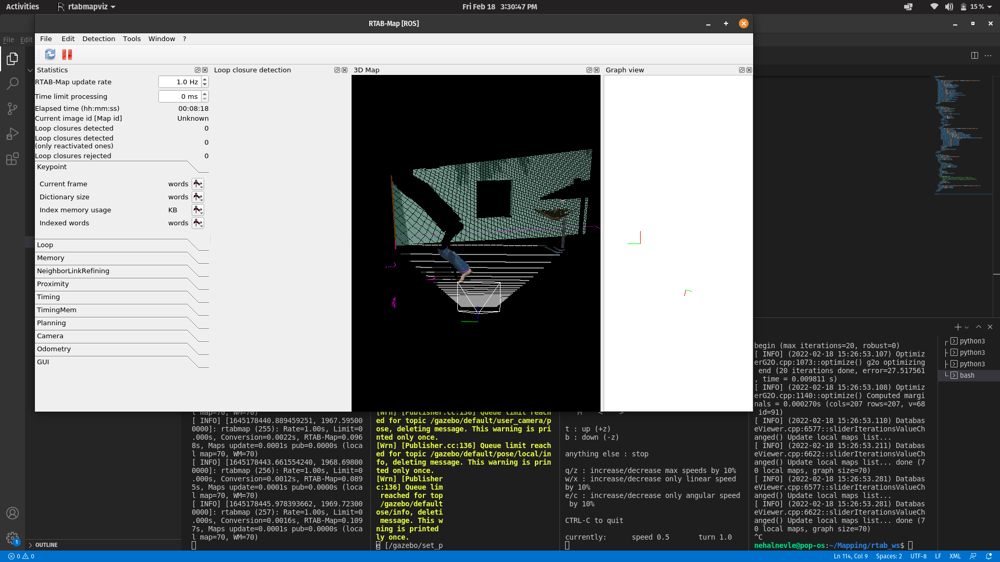

# Mapping
Computer vision and cartography are related to robotic mapping. It is the goal of an autonomous robot to be able to build (or use) a map (outdoor use) or a floor plan (indoor use) and to localize itself, as well as its recharging bases or beacons, on it. Robotic mapping involves the study and application of the robot's ability to locate itself on a map or plan and, in some cases, construct the map or floor plan itself.

## SLAM
SLAM refers to a problem of constructing or updating a map of an unknown environment while keeping track of an agent's position within it simultaneously. Although this appears to be a chicken-and-egg problem, there are several algorithms that can solve it, at least roughly, in tractable time for certain environments. The particle filter, extended Kalman filter, covariance intersection, and GraphSLAM are popular approximate solution methods. In robotic navigation, robotic mapping and odometry for virtual or augmented reality, SLAM algorithms are based on concepts in computational geometry and computer vision.

## FAST SLAM
The FastSLAM algorithm solves the Full SLAM problem with known correspondences.

Estimating the Trajectory: FastSLAM estimates a posterior over the trajectory using a particle filter approach. This will give an advantage to SLAM to solve the problem of mapping with known poses.
Estimating the Map: FastSLAM uses a low dimensional Extended Kalman Filter to solve independent features of the map which are modeled with local Gaussian.
The custom approach of representing the posterior with particle filter and Gaussian is known by the Rao-Blackwellized particle filter approach.

## GraphSLAM

A graph-based SLAM approach constructs a simplified estimation problem by abstracting the raw sensor measurements. These raw measurements are replaced by the edges in the graph which can then be seen as “virtual measurements”. in which useconstatians to get the equtations and solve them itretativly to reach the best possible estimate.

## RTAB

RTAB-Map (Real-Time Appearance-Based Mapping) is a RGB-D, Stereo and Lidar Graph-Based SLAM approach based on an incremental appearance-based loop closure detector. The loop closure detector uses a bag-of-words approach to determinate how likely a new image comes from a previous location or a new location.

## Implemtation

